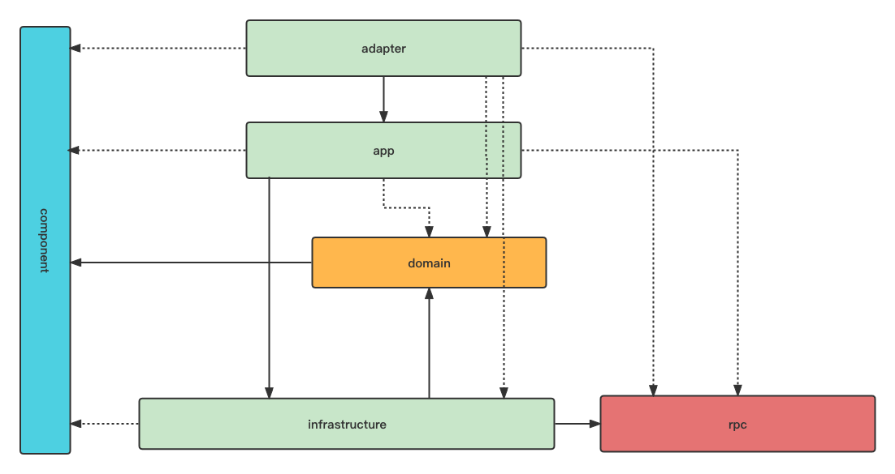

### ddd-example
DDD 分包分层规范及通用组件说明


### 项目分层说明


- adapter: web层(应用层)
- domain: 领域层
- infrastructure：数据层
- app:应用层
- rpc: 远程rpc调用
- component: 基础组件层

> rpc层可以单独拆分一个模块出来,地位和infrastructure层一致，都是属于数据层，也可以直接放在infrastructure层
> 整体架构设计参考[CLOA](https://github.com/alibaba/COLA)阿里简洁架构设计
> 没有一层不变的架构设计，只有最合适的

### 为什么 app层可以直接越过领域层直达infrastructure

### 基础服务框架
推荐使用[spring-boot-nebula](https://github.com/weihubeats/spring-boot-nebula)

### 编码规范

#### 代码规范
idea代码格式统一使用 [spring-boot-nebula style](https://github.com/weihubeats/spring-boot-nebula/blob/master/style/Intellij_nebula_Java_Conventions.xml)

#### 依赖注入

依赖注意统一采用构造器注入，不要使用`@Autowired`注解
结合`lombok`的`@RequiredArgsConstructor`注解

```java
@Slf4j
@RestController("/order/v1")
@RequiredArgsConstructor
public class OrderController {

    private final OrderApplicationService orderApplicationService;
    
    
}
```

#### 参数校验

参数校验禁止在`controller`层进行校验，应该在`service`层进行校验

详细说明参考博客[参数校验](https://blog.csdn.net/qq_42651904/article/details/144620951?sharetype=blogdetail&sharerId=144620951&sharerefer=PC&sharesource=qq_42651904&spm=1011.2480.3001.8118)

### 集成测试编写规范

集成测试推荐使用`MockMvc`进行测试

[参考博客](https://blog.csdn.net/qq_42651904/article/details/144418252?spm=1001.2014.3001.5501)

### 事件驱动编程的重要性

不同领域之间的通信我们都推荐使用事件通信。

任何现实业务逻辑的变化都会有相应的事件触发，从而触发下游业务逻辑的变更

比如下单操作，就出发了一个下单时间，这时候对于下单时间我们需要有其他业务逻辑的处理就形成了解耦。
我们不需要再下单之后修改原有的下单逻辑，只需要监听下单逻辑，然后处理相应的时间。比如下单后需要扣减库存、添加积分等。
都是一个个独立的事件监听，相互不会影响

事件驱动不要使用`spring event`,会丢失事件
推荐自研或者参考[event-bus-rocketmq-all](https://github.com/weihubeats/event-bus-rocketmq-all)

### 分布式事务
如果使用领域事件，必然存在分布式事务问题。
存在两种选择
1. 先发领域事件，后提交事务
2. 先提交事务，后发领域事件

推荐先提交事务后发领域事件
有两种方式
1. 发送延时消息
2. 利用`TransactionSynchronizationManager`
```java
    @Transactional
    public void createOrder() {
        // 业务逻辑
        // 发送领域事件
        TransactionSynchronizationManager.registerSynchronization(new TransactionSynchronizationAdapter() {
            @Override
            public void afterCommit() {
                // 发送领域事件
            }
        });
    }
```

> 一般情况下我们认为领域事件发送失败概率比较小，所以我们可以先提交事务(事务提交失败概率会大一点，比如业务逻辑导致的数据重复插入、数据异常插入失败等)，再发送领域事件

领域事件发送的数据尽量不应该依赖于数据库。

分布式事务我们可以不处理，如果处理推荐使用最终一致性


### 如何避免出现上帝聚合根

上帝聚合根是指一个聚合根包含了所有的业务逻辑，这样的聚合根会变得非常臃肿，不利于维护和扩展。

### 函数式编程构造聚合根

#### 事务使用规范
1. 非特殊配置只有定义`public`方法上面的`@Transactional`才生效
2. 必须通过代理过的类从外部调用目标方法才生效
3. 默认只有出现`RuntimeException`或者`Error`才会回滚。所以强制指定异常的回滚范围比如`@Transactional(rollbackFor = Exception.class)`
4. 合理使用事务的传播行为

## idea插件推荐
[idea插件推荐.md](https://weihubeats.github.io/docs/java/idea/%E5%B8%B8%E7%94%A8%E6%8F%92%E4%BB%B6)


## 研发常用软件安装

- IntelliJ IDEA java编码最好用idea
- GoLand golang编码软件
- DataGrip 数据库管理软件
- Postman 接口调试软件
- Apifox 接口调试软件
- Visual Studio Code 啥都能写
- Xnip 截图软件
- Tabby 终端软件
- RedisInsight Redis可视化软件
- prettyZoo Zookeeper可视化软件
- Sublime Text 文本编辑器
- mat java dump分析工具
- Docker 容器软件
- Charles 抓包软件
- Beyond Compare 文件对比软件
- uTools 各种小工具
- Google Chrome 浏览器